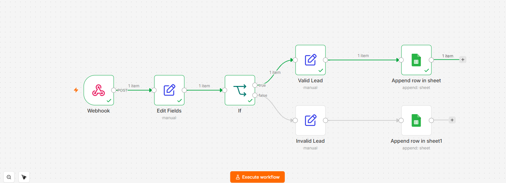

## 📸 Workflow Preview

# 🚀 Lead Management Automation using n8n

A beginner-friendly **Lead Management Automation** workflow built using **n8n, Webhooks, Conditional Logic, and Google Sheets**.

This project receives lead information through a webhook, validates the email field, separates valid and invalid leads, and automatically stores the data in Google Sheets.

---

## 📌 Project Overview

This automation is designed to handle lead submissions automatically.

The workflow:

1. 📥 Receives lead data through a Webhook
2. 🔄 Processes the incoming data
3. ✅ Checks whether the email is available
4. 🟢 Stores valid leads in Google Sheets
5. 🔴 Stores invalid leads separately
6. 📊 Maintains a simple Lead Management Sheet

---

## 🔄 Workflow

```text
Webhook
   ↓
Prepare Lead Data
   ↓
Validate Email
   ↓
   ├── ✅ Valid Lead
   │       ↓
   │   Save Valid Lead
   │       ↓
   │   Google Sheets
   │
   └── ❌ Invalid Lead
           ↓
       Save Invalid Lead
           ↓
       Google Sheets
